# Historical Gallery

## Overview

Photographs and competition-arena images from the former ALeRT
tutorial, documenting past RoboCup Rescue League participation and the
Spot platform.

:::{admonition} Historical snapshot
:class: note

These images date from the former ALeRT tutorial and past competition
years. They are not evidence of the team's or the platform's current
state.
:::

## Provenance

Every image below is migrated unchanged (no recompression, no
upscaling) from the former ALeRT tutorial's source material, with its
origin, checksum comparison, and alt text tracked internally in
`maintainers/historical-asset-migration.md`. Images that showed
credentials, network information, or other sensitive content in the
source material were excluded rather than migrated — see
`maintainers/spot-security-audit.md` (internal).

## Competition and team

```{raw} html
<div class="sd-container-fluid sd-sphinx-override sd-mb-4 docutils">
<div class="sd-row sd-row-cols-1 sd-row-cols-xs-1 sd-row-cols-sm-2 sd-row-cols-md-2 sd-row-cols-lg-2 sd-g-3 sd-g-xs-3 sd-g-sm-3 sd-g-md-3 sd-g-lg-3 docutils">
<div class="sd-col sd-d-flex-row docutils">
<div class="sd-card sd-sphinx-override sd-w-100 sd-shadow-sm docutils">
<a href="../_static/images/history/award_ceremony.jpg" target="_blank" rel="noopener">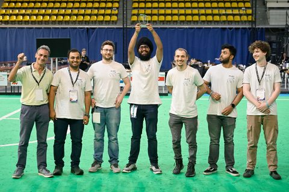</a>
<div class="sd-card-body docutils">
<div class="sd-card-title sd-font-weight-bold docutils">Award ceremony</div>
<p class="sd-card-text">The ALeRT team at a RoboCup Rescue League award ceremony, with the competition trophy.</p>
</div></div></div>
<div class="sd-col sd-d-flex-row docutils">
<div class="sd-card sd-sphinx-override sd-w-100 sd-shadow-sm docutils">
<a href="../_static/images/history/spot_gravel_sitting.jpg" target="_blank" rel="noopener">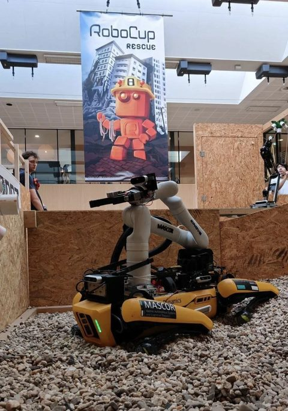</a>
<div class="sd-card-body docutils">
<div class="sd-card-title sd-font-weight-bold docutils">Spot on gravel</div>
<p class="sd-card-text">Spot seated on a gravel/rubble-like surface, illustrating the kind of terrain the competition's maneuvering and mobility challenge tests.</p>
</div></div></div>
<div class="sd-col sd-d-flex-row docutils">
<div class="sd-card sd-sphinx-override sd-w-100 sd-shadow-sm docutils">
<a href="../_static/images/history/rrl_eindhoven_group.png" target="_blank" rel="noopener">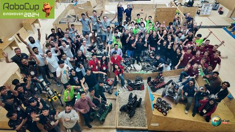</a>
<div class="sd-card-body docutils">
<div class="sd-card-title sd-font-weight-bold docutils">RRL Eindhoven group photo</div>
<p class="sd-card-text">A RoboCup Rescue League group/event photograph, referenced alongside the tutorial's account of the league's origin.</p>
</div></div></div>
<div class="sd-col sd-d-flex-row docutils">
<div class="sd-card sd-sphinx-override sd-w-100 sd-shadow-sm docutils">
<a href="../_static/images/history/resuceleague_teams.png" target="_blank" rel="noopener">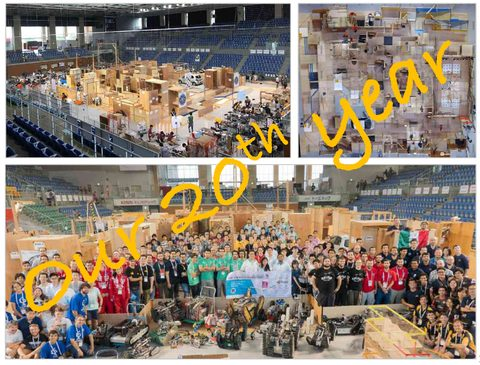</a>
<div class="sd-card-body docutils">
<div class="sd-card-title sd-font-weight-bold docutils">Rescue league teams</div>
<p class="sd-card-text">Teams competing in the RoboCup Rescue League.</p>
</div></div></div>
</div></div>
```

## Arena and terrain

```{raw} html
<div class="sd-container-fluid sd-sphinx-override sd-mb-4 docutils">
<div class="sd-row sd-row-cols-1 sd-row-cols-xs-1 sd-row-cols-sm-2 sd-row-cols-md-3 sd-row-cols-lg-3 sd-g-3 sd-g-xs-3 sd-g-sm-3 sd-g-md-3 sd-g-lg-3 docutils">
<div class="sd-col sd-d-flex-row docutils">
<div class="sd-card sd-sphinx-override sd-w-100 sd-shadow-sm docutils">
<a href="../_static/images/history/arena3.png" target="_blank" rel="noopener">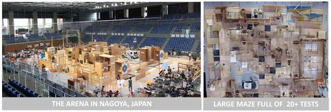</a>
<div class="sd-card-body docutils">
<div class="sd-card-title sd-font-weight-bold docutils">Arena (2019 rulebook)</div>
<p class="sd-card-text">The competition arena, 2019 rulebook.</p>
</div></div></div>
<div class="sd-col sd-d-flex-row docutils">
<div class="sd-card sd-sphinx-override sd-w-100 sd-shadow-sm docutils">
<a href="../_static/images/history/arena.png" target="_blank" rel="noopener">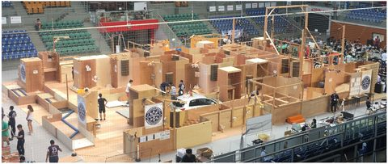</a>
<div class="sd-card-body docutils">
<div class="sd-card-title sd-font-weight-bold docutils">Arena (exploration)</div>
<p class="sd-card-text">The arena used for the exploration challenge.</p>
</div></div></div>
<div class="sd-col sd-d-flex-row docutils">
<div class="sd-card sd-sphinx-override sd-w-100 sd-shadow-sm docutils">
<a href="../_static/images/history/arena2.png" target="_blank" rel="noopener">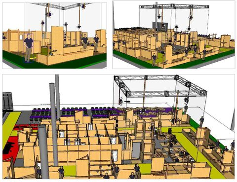</a>
<div class="sd-card-body docutils">
<div class="sd-card-title sd-font-weight-bold docutils">Arena (smaller teams)</div>
<p class="sd-card-text">The new arena from the "updated tasks for smaller teams" ruleset.</p>
</div></div></div>
<div class="sd-col sd-d-flex-row docutils">
<div class="sd-card sd-sphinx-override sd-w-100 sd-shadow-sm docutils">
<a href="../_static/images/history/RRL_arena.png" target="_blank" rel="noopener">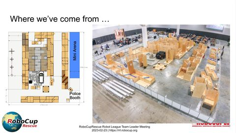</a>
<div class="sd-card-body docutils">
<div class="sd-card-title sd-font-weight-bold docutils">RRL arena</div>
<p class="sd-card-text">The Rescue League competition arena referenced in the team's course introduction material.</p>
</div></div></div>
<div class="sd-col sd-d-flex-row docutils">
<div class="sd-card sd-sphinx-override sd-w-100 sd-shadow-sm docutils">
<a href="../_static/images/history/terrain1.png" target="_blank" rel="noopener">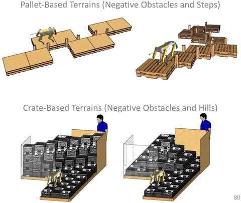</a>
<div class="sd-card-body docutils">
<div class="sd-card-title sd-font-weight-bold docutils">Terrain 1</div>
<p class="sd-card-text">Terrain type 1 of 4, "updated tasks for smaller teams" ruleset. See [RoboCup Rescue](robocup-rescue.md).</p>
</div></div></div>
<div class="sd-col sd-d-flex-row docutils">
<div class="sd-card sd-sphinx-override sd-w-100 sd-shadow-sm docutils">
<a href="../_static/images/history/terrain2.png" target="_blank" rel="noopener">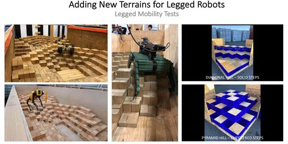</a>
<div class="sd-card-body docutils">
<div class="sd-card-title sd-font-weight-bold docutils">Terrain 2</div>
<p class="sd-card-text">Terrain type 2 of 4.</p>
</div></div></div>
<div class="sd-col sd-d-flex-row docutils">
<div class="sd-card sd-sphinx-override sd-w-100 sd-shadow-sm docutils">
<a href="../_static/images/history/terrain3.png" target="_blank" rel="noopener">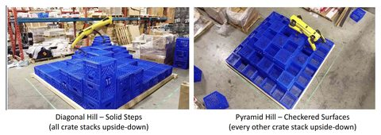</a>
<div class="sd-card-body docutils">
<div class="sd-card-title sd-font-weight-bold docutils">Terrain 3</div>
<p class="sd-card-text">Terrain type 3 of 4.</p>
</div></div></div>
<div class="sd-col sd-d-flex-row docutils">
<div class="sd-card sd-sphinx-override sd-w-100 sd-shadow-sm docutils">
<a href="../_static/images/history/terrain4.png" target="_blank" rel="noopener">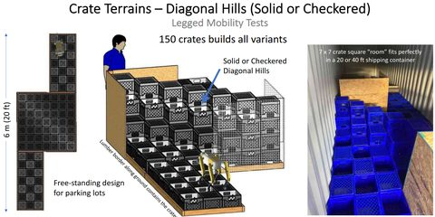</a>
<div class="sd-card-body docutils">
<div class="sd-card-title sd-font-weight-bold docutils">Terrain 4</div>
<p class="sd-card-text">Terrain type 4 of 4.</p>
</div></div></div>
<div class="sd-col sd-d-flex-row docutils">
<div class="sd-card sd-sphinx-override sd-w-100 sd-shadow-sm docutils">
<a href="../_static/images/history/maneuvering.png" target="_blank" rel="noopener">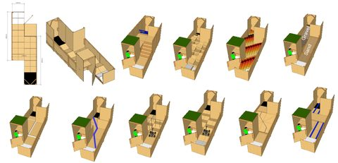</a>
<div class="sd-card-body docutils">
<div class="sd-card-title sd-font-weight-bold docutils">Maneuvering</div>
<p class="sd-card-text">An obstacle/surface setup from the maneuvering and mobility challenge.</p>
</div></div></div>
</div></div>
```

## Dexterity and exploration

```{raw} html
<div class="sd-container-fluid sd-sphinx-override sd-mb-4 docutils">
<div class="sd-row sd-row-cols-1 sd-row-cols-xs-1 sd-row-cols-sm-2 sd-row-cols-md-3 sd-row-cols-lg-3 sd-g-3 sd-g-xs-3 sd-g-sm-3 sd-g-md-3 sd-g-lg-3 docutils">
<div class="sd-col sd-d-flex-row docutils">
<div class="sd-card sd-sphinx-override sd-w-100 sd-shadow-sm docutils">
<a href="../_static/images/history/Dexterity_board.png" target="_blank" rel="noopener">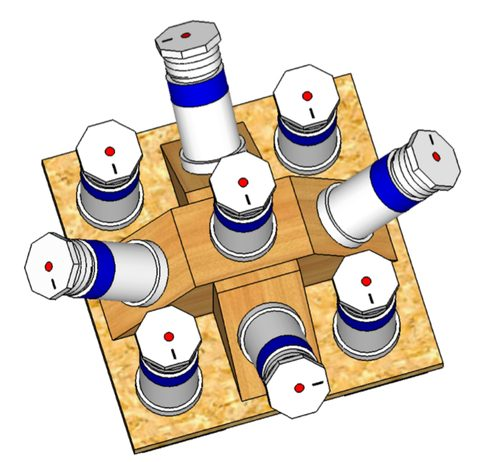</a>
<div class="sd-card-body docutils">
<div class="sd-card-title sd-font-weight-bold docutils">Dexterity board</div>
<p class="sd-card-text">The dexterity test board used in the dexterity challenge.</p>
</div></div></div>
<div class="sd-col sd-d-flex-row docutils">
<div class="sd-card sd-sphinx-override sd-w-100 sd-shadow-sm docutils">
<a href="../_static/images/history/door.png" target="_blank" rel="noopener">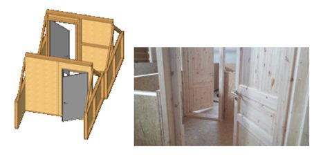</a>
<div class="sd-card-body docutils">
<div class="sd-card-title sd-font-weight-bold docutils">Door</div>
<p class="sd-card-text">A door-opening/turning task from the dexterity challenge.</p>
</div></div></div>
<div class="sd-col sd-d-flex-row docutils">
<div class="sd-card sd-sphinx-override sd-w-100 sd-shadow-sm docutils">
<a href="../_static/images/history/Emergency.png" target="_blank" rel="noopener">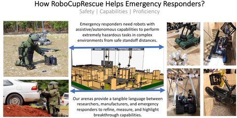</a>
<div class="sd-card-body docutils">
<div class="sd-card-title sd-font-weight-bold docutils">Emergency</div>
<p class="sd-card-text">Imagery associated with the "sign of life" / emergency scenario aspect of the exploration challenge.</p>
</div></div></div>
<div class="sd-col sd-d-flex-row docutils">
<div class="sd-card sd-sphinx-override sd-w-100 sd-shadow-sm docutils">
<a href="../_static/images/history/Exploration1.png" target="_blank" rel="noopener">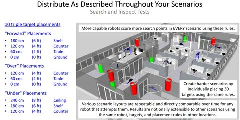</a>
<div class="sd-card-body docutils">
<div class="sd-card-title sd-font-weight-bold docutils">Exploration 1</div>
<p class="sd-card-text">Exploration-challenge scene 1 of 4, "updated tasks for smaller teams" ruleset.</p>
</div></div></div>
<div class="sd-col sd-d-flex-row docutils">
<div class="sd-card sd-sphinx-override sd-w-100 sd-shadow-sm docutils">
<a href="../_static/images/history/Exploration2.png" target="_blank" rel="noopener">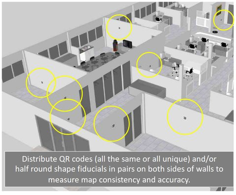</a>
<div class="sd-card-body docutils">
<div class="sd-card-title sd-font-weight-bold docutils">Exploration 2</div>
<p class="sd-card-text">Exploration-challenge scene 2 of 4.</p>
</div></div></div>
<div class="sd-col sd-d-flex-row docutils">
<div class="sd-card sd-sphinx-override sd-w-100 sd-shadow-sm docutils">
<a href="../_static/images/history/Exploration3.png" target="_blank" rel="noopener">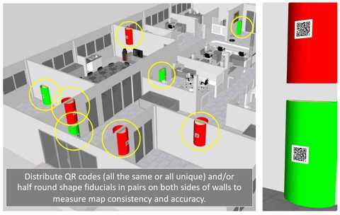</a>
<div class="sd-card-body docutils">
<div class="sd-card-title sd-font-weight-bold docutils">Exploration 3</div>
<p class="sd-card-text">Exploration-challenge scene 3 of 4.</p>
</div></div></div>
<div class="sd-col sd-d-flex-row docutils">
<div class="sd-card sd-sphinx-override sd-w-100 sd-shadow-sm docutils">
<a href="../_static/images/history/Exploration4.png" target="_blank" rel="noopener">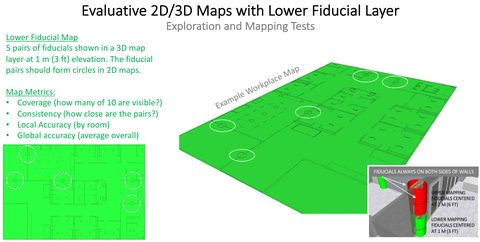</a>
<div class="sd-card-body docutils">
<div class="sd-card-title sd-font-weight-bold docutils">Exploration 4</div>
<p class="sd-card-text">Exploration-challenge scene 4 of 4.</p>
</div></div></div>
<div class="sd-col sd-d-flex-row docutils">
<div class="sd-card sd-sphinx-override sd-w-100 sd-shadow-sm docutils">
<a href="../_static/images/history/objective1.png" target="_blank" rel="noopener">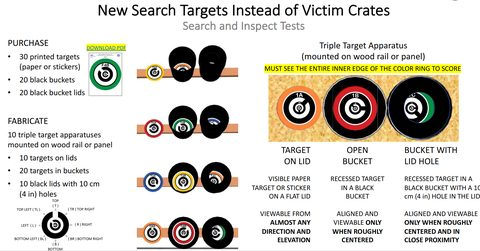</a>
<div class="sd-card-body docutils">
<div class="sd-card-title sd-font-weight-bold docutils">Objective 1</div>
<p class="sd-card-text">Detection objective 1 of 2, "updated tasks for smaller teams" ruleset.</p>
</div></div></div>
<div class="sd-col sd-d-flex-row docutils">
<div class="sd-card sd-sphinx-override sd-w-100 sd-shadow-sm docutils">
<a href="../_static/images/history/objective2.png" target="_blank" rel="noopener">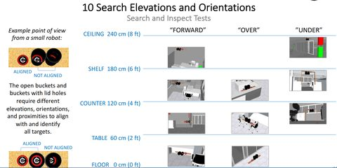</a>
<div class="sd-card-body docutils">
<div class="sd-card-title sd-font-weight-bold docutils">Objective 2</div>
<p class="sd-card-text">Detection objective 2 of 2.</p>
</div></div></div>
<div class="sd-col sd-d-flex-row docutils">
<div class="sd-card sd-sphinx-override sd-w-100 sd-shadow-sm docutils">
<a href="../_static/images/history/readiness.png" target="_blank" rel="noopener">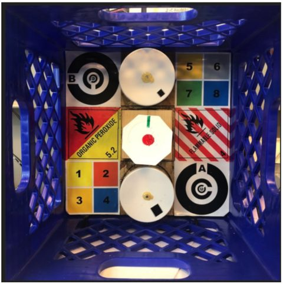</a>
<div class="sd-card-body docutils">
<div class="sd-card-title sd-font-weight-bold docutils">Readiness</div>
<p class="sd-card-text">The readiness-test setup (sensor and dexterity capability checks).</p>
</div></div></div>
<div class="sd-col sd-d-flex-row docutils">
<div class="sd-card sd-sphinx-override sd-w-100 sd-shadow-sm docutils">
<a href="../_static/images/history/tests.png" target="_blank" rel="noopener">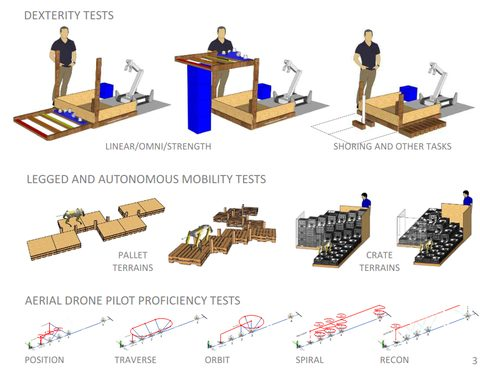</a>
<div class="sd-card-body docutils">
<div class="sd-card-title sd-font-weight-bold docutils">Tests</div>
<p class="sd-card-text">The new readiness tests introduced in the "updated tasks for smaller teams" ruleset.</p>
</div></div></div>
</div></div>
```

## Verification

`Historical procedure` — every image on this page documents a past
state of the competition or the team, not current equipment,
personnel, or rules.

## Related components

[ALeRT and Spot](alert-and-spot.md), [RoboCup Rescue](robocup-rescue.md).
